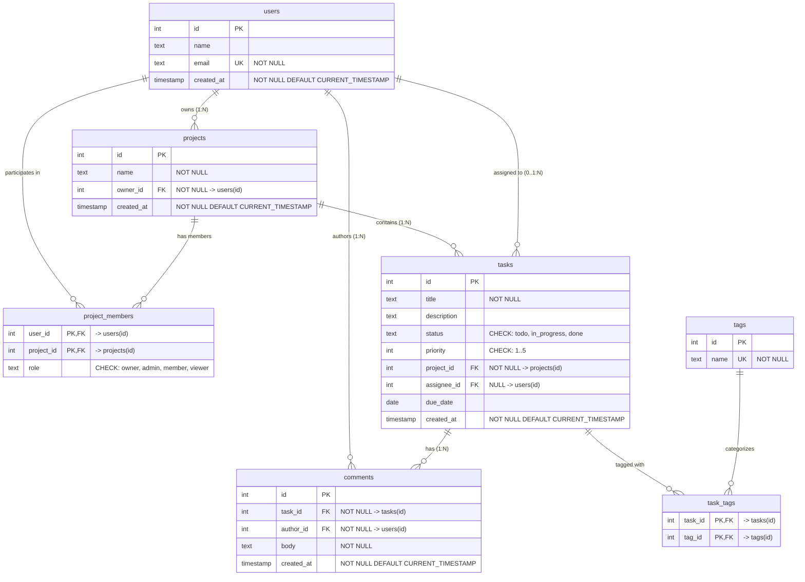

# CMIT Full-Stack Internship — Week 5: Assignment 1 (Schema & Seed)

**Domain:** Task Management Platform  
**Database:** PostgreSQL  
**Deliverables:** `schema.sql`, `seed.sql`, and modular task directories (`w1/`, `w2/`, `c1/`, `c2/`, `c3/`, `c4/`)

---

## 📌 Project Overview

This repository contains the complete PostgreSQL database schema design and seed dataset for a **Task Management Platform**, developed as part of **Week 5 (Assignment 1)** of the CMIT Full-Stack Internship Program delivered by Coding Pixel.

The database is built from first principles in raw SQL with strict referential integrity, domain constraints, cascading rules, and rich sample data supporting advanced analytical queries.

---

## 🗂️ Project Structure

```text
Assignment1/
├── schema.sql           # Complete consolidated schema (DDL, constraints, FKs, composite PKs)
├── seed.sql             # Complete seed dataset (Users, Projects, Members, Tasks, Tags, Comments)
├── README.md            # Project documentation and setup guide
├── w1/
│   └── w1.sql           # W1: Table Creation (DDL) for all 7 tables
├── w2/
│   └── w2.sql           # W2: CHECK and UNIQUE constraints
├── c1/
│   └── c1.sql           # C1: Foreign keys and ON DELETE referential rules
├── c2/
│   └── c2.sql           # C2: Composite primary keys on junction tables
├── c3/
│   └── c3.sql           # C3: Seed data script
└── c4/
    └── C4.md            # C4: Guide for automated, reproducible database setup
```

---

## 🏛️ Database Schema Design

The schema consists of **7 core tables** modeling the task management lifecycle:



---

## 📋 Task Breakdown & Solutions

### 1. W1: Table Creation (DDL)
* Created all 7 tables with appropriate PostgreSQL column types (`SERIAL`, `INTEGER`, `TEXT`, `DATE`, `TIMESTAMP`).
* Enforced `NOT NULL` on mandatory columns (`email`, `title`, `owner_id`, `project_id`, `author_id`, `body`, `created_at`).
* Allowed `NULL` on optional columns (`assignee_id` for unassigned tasks, `due_date`, `description`, and `name`).

### 2. W2: Check & Unique Constraints
* **`tasks_status_check`**: `CHECK (status IN ('todo', 'in_progress', 'done'))`
* **`tasks_priority_check`**: `CHECK (priority BETWEEN 1 AND 5)`
* **`project_members_role_check`**: `CHECK (role IN ('owner', 'admin', 'member', 'viewer'))`
* **`users_email_unique`**: `UNIQUE (email)` (prevents duplicate registrations)
* **`tags_name_unique`**: `UNIQUE (name)` (prevents duplicate tags)

### 3. C1: Foreign Keys & Referential Actions (`ON DELETE`)
* **`projects.owner_id` $\rightarrow$ `users(id)`**: `ON DELETE RESTRICT` (protects project ownership).
* **`project_members.user_id` $\rightarrow$ `users(id)`**: `ON DELETE CASCADE`
* **`project_members.project_id` $\rightarrow$ `projects(id)`**: `ON DELETE CASCADE` (deleting project removes memberships).
* **`tasks.project_id` $\rightarrow$ `projects(id)`**: `ON DELETE CASCADE` (deleting project removes its tasks).
* **`tasks.assignee_id` $\rightarrow$ `users(id)`**: `ON DELETE SET NULL` (deleting a user unassigns tasks rather than deleting work).
* **`task_tags.task_id` $\rightarrow$ `tasks(id)`**: `ON DELETE CASCADE` (deleting task removes its tag associations).
* **`task_tags.tag_id` $\rightarrow$ `tags(id)`**: `ON DELETE CASCADE` (deleting tag removes its associations).
* **`comments.task_id` $\rightarrow$ `tasks(id)`**: `ON DELETE CASCADE` (deleting task removes discussion comments).
* **`comments.author_id` $\rightarrow$ `users(id)`**: `ON DELETE RESTRICT` (preserves comment history).

### 4. C2: Composite Primary Keys
* **`project_members`**: `PRIMARY KEY (user_id, project_id)` — Guarantees a user can have only one role per project.
* **`task_tags`**: `PRIMARY KEY (task_id, tag_id)` — Guarantees a tag is attached to a task at most once.

### 5. C3: Seed Dataset (`seed.sql`)
The dataset exceeds all required minimum count thresholds and incorporates all **4 special edge cases**:

| Entity | Requirement | Seed Count | Included Edge Cases & Coverage |
| :--- | :---: | :---: | :--- |
| **`users`** | Min. 6 | **7** | Includes user with **0 assigned tasks** (*George Clark*). |
| **`projects`** | Min. 3 | **4** | Includes empty project with **0 tasks** (*Delta Empty Project*). |
| **`project_members`** | Min. 6 | **9** | Complete distribution across `owner`, `admin`, `member`, and `viewer`. |
| **`tasks`** | Min. 15 | **16** | • Tasks with `assignee_id = NULL` (Unassigned)<br>• Overdue non-done tasks with `due_date < CURRENT_DATE`<br>• Tasks with `due_date = NULL` for `NULLS LAST` testing<br>• Clear leaderboard for `done` tasks (Alice: 3, Bob: 2, Charlie: 1) |
| **`tags`** | Min. 6 | **7** | `frontend`, `backend`, `bug`, `feature`, `urgent`, `database`, `devops` |
| **`task_tags`** | Min. 20 | **24** | Tasks with multiple tags as well as tasks with 0 tags. |
| **`comments`** | Min. 10 | **12** | Tasks with multiple comments and tasks with 0 comments. |

### 6. C4: Automated & Reproducible Setup
Both schema and seed scripts run end-to-end without manual intervention on a clean database.

---

## 🚀 Quickstart & Setup Guide

### 1. Recreate the Database
```bash
# Drop existing database if it exists
dropdb -U postgres assignment1

# Create fresh empty database
createdb -U postgres assignment1
```

### 2. Run Schema & Seed Scripts
Execute both scripts in sequential order:
```bash
psql -U postgres -d assignment1 -f schema.sql -f seed.sql
```

---

## 🔍 Verification & Acceptance Checks

Connect to PostgreSQL CLI:
```bash
psql -U postgres -d assignment1
```

### Verify Table Creation
```sql
\dt
```
*Expected: 7 tables listed (`comments`, `project_members`, `projects`, `tags`, `task_tags`, `tasks`, `users`).*

### Verify Row Counts
```sql
SELECT 'users' AS table_name, count(*) FROM users
UNION ALL
SELECT 'projects', count(*) FROM projects
UNION ALL
SELECT 'project_members', count(*) FROM project_members
UNION ALL
SELECT 'tasks', count(*) FROM tasks
UNION ALL
SELECT 'tags', count(*) FROM tags
UNION ALL
SELECT 'task_tags', count(*) FROM task_tags
UNION ALL
SELECT 'comments', count(*) FROM comments;
```

### Verify Key Special Edge Cases
```sql
-- 1. Unassigned tasks
SELECT count(*) AS unassigned_tasks FROM tasks WHERE assignee_id IS NULL;

-- 2. Overdue non-done tasks
SELECT count(*) AS overdue_tasks FROM tasks WHERE due_date < CURRENT_DATE AND status <> 'done';

-- 3. Projects with 0 tasks
SELECT p.id, p.name FROM projects p LEFT JOIN tasks t ON t.project_id = p.id WHERE t.id IS NULL;

-- 4. Users with 0 tasks
SELECT u.id, u.name FROM users u LEFT JOIN tasks t ON t.assignee_id = u.id WHERE t.id IS NULL;
```
