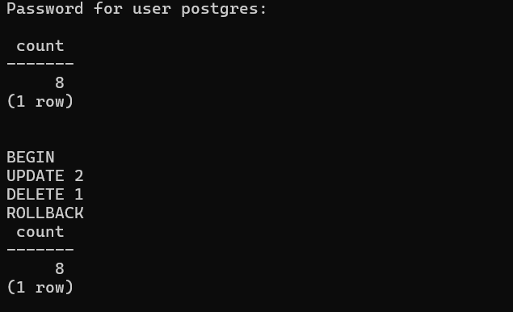

## W1
## Index on tasks.project_id

The index on `tasks.project_id` helps queries that search or join tasks by project, such as Q1 in Assingment2, which retrieves all tasks for one project.

It can reduce the amount of data PostgreSQL needs to scan when finding tasks for a specific `project_id`.


# W2

## idx_tasks_status
Helps queries that filter tasks by status, such as Q5 and Q6 in Assignment2.

## idx_tasks_assignee_id
Helps queries that join users with their assigned tasks using `assignee_id`, such as Q3 in Assignment2.

## idx_tasks_due_date

This index can help Q5 in Assignment2 because the query filters tasks using
`due_date < CURRENT_DATE`.

It may also help queries that order or search tasks by due date.


# C2




# C3: EXPLAIN ANALYZE Comparisons

## Pair 1: Query 1 (Filter by `project_id`)

**Query:**
```sql
SELECT *
FROM tasks
WHERE project_id = 10
ORDER BY due_date ASC NULLS LAST;
```

### Before Index (`DROP INDEX IF EXISTS idx_tasks_project_id;`):
```text
                                                QUERY PLAN
----------------------------------------------------------------------------------------------------------
 Sort  (cost=1.21..1.21 rows=1 width=124) (actual time=0.556..0.557 rows=9.00 loops=1)
   Sort Key: due_date
   Sort Method: quicksort  Memory: 26kB
   Buffers: shared hit=4 dirtied=1
   ->  Seq Scan on tasks  (cost=0.00..1.20 rows=1 width=124) (actual time=0.042..0.044 rows=9.00 loops=1)
         Filter: (project_id = 10)
         Rows Removed by Filter: 7
         Buffers: shared hit=1 dirtied=1
 Planning:
   Buffers: shared hit=147 dirtied=1
 Planning Time: 3.530 ms
 Execution Time: 0.607 ms
(12 rows)
```

### After Index (`CREATE INDEX idx_tasks_project_id ON tasks(project_id);`):
```text
                                                QUERY PLAN
----------------------------------------------------------------------------------------------------------
 Sort  (cost=1.21..1.21 rows=1 width=124) (actual time=0.022..0.023 rows=9.00 loops=1)
   Sort Key: due_date
   Sort Method: quicksort  Memory: 26kB
   Buffers: shared hit=1
   ->  Seq Scan on tasks  (cost=0.00..1.20 rows=1 width=124) (actual time=0.014..0.016 rows=9.00 loops=1)
         Filter: (project_id = 10)
         Rows Removed by Filter: 7
         Buffers: shared hit=1
 Planning:
   Buffers: shared hit=15 read=1
 Planning Time: 1.181 ms
 Execution Time: 0.038 ms
(12 rows)
```

### Analysis:
- **Scan Node:** Both plans used `Seq Scan on tasks`. The query planner chose a sequential scan over `idx_tasks_project_id` because the table currently contains only 16 rows (9 returned, 7 removed by filter), fitting entirely inside a single 8KB disk page (`Buffers: shared hit=1`). Reading the entire page sequentially in memory has zero random I/O overhead and is cheaper than traversing index pages and then fetching the heap tuples.
- **Cost & Timing:** The estimated cost remained `1.21..1.21`. Planning time decreased from `3.530 ms` to `1.181 ms`, and execution time decreased from `0.607 ms` to `0.038 ms` due to cached buffer hits in memory.

---

## Pair 2: Query 5 (Filter by `due_date`)

**Query:**
```sql
SELECT tasks.*, users.name AS assignee_name
FROM tasks
LEFT JOIN users
    ON tasks.assignee_id = users.id
WHERE tasks.due_date < CURRENT_DATE
  AND tasks.status <> 'done';
```

### Before Index (`DROP INDEX IF EXISTS idx_tasks_due_date;`):
```text
                                                   QUERY PLAN
----------------------------------------------------------------------------------------------------------------
 Hash Right Join  (cost=1.34..22.12 rows=5 width=156) (actual time=0.052..0.056 rows=3.00 loops=1)
   Hash Cond: (users.id = tasks.assignee_id)
   Buffers: shared hit=2
   ->  Seq Scan on users  (cost=0.00..17.80 rows=780 width=36) (actual time=0.013..0.014 rows=7.00 loops=1)
         Buffers: shared hit=1
   ->  Hash  (cost=1.28..1.28 rows=5 width=124) (actual time=0.027..0.028 rows=3.00 loops=1)
         Buckets: 1024  Batches: 1  Memory Usage: 9kB
         Buffers: shared hit=1
         ->  Seq Scan on tasks  (cost=0.00..1.28 rows=5 width=124) (actual time=0.019..0.021 rows=3.00 loops=1)
               Filter: ((status <> 'done'::text) AND (due_date < CURRENT_DATE))
               Rows Removed by Filter: 13
               Buffers: shared hit=1
 Planning:
   Buffers: shared hit=104
 Planning Time: 3.189 ms
 Execution Time: 0.087 ms
(16 rows)
```

### After Index (`CREATE INDEX idx_tasks_due_date ON tasks(due_date);`):
```text
                                                   QUERY PLAN
----------------------------------------------------------------------------------------------------------------
 Hash Right Join  (cost=1.34..22.12 rows=5 width=156) (actual time=0.025..0.029 rows=3.00 loops=1)
   Hash Cond: (users.id = tasks.assignee_id)
   Buffers: shared hit=2
   ->  Seq Scan on users  (cost=0.00..17.80 rows=780 width=36) (actual time=0.005..0.005 rows=7.00 loops=1)
         Buffers: shared hit=1
   ->  Hash  (cost=1.28..1.28 rows=5 width=124) (actual time=0.016..0.017 rows=3.00 loops=1)
         Buckets: 1024  Batches: 1  Memory Usage: 9kB
         Buffers: shared hit=1
         ->  Seq Scan on tasks  (cost=0.00..1.28 rows=5 width=124) (actual time=0.012..0.015 rows=3.00 loops=1)
               Filter: ((status <> 'done'::text) AND (due_date < CURRENT_DATE))
               Rows Removed by Filter: 13
               Buffers: shared hit=1
 Planning:
   Buffers: shared hit=21 read=1
 Planning Time: 1.376 ms
 Execution Time: 0.045 ms
(16 rows)
```

### Analysis:
- **Scan Node:** The query planner executed a `Hash Right Join` with sequential scans on `users` and `tasks`. Since both tables have very few rows (7 users, 16 tasks), the cost-based optimizer bypassed `idx_tasks_due_date` in favor of a sequential scan (`Seq Scan on tasks`, cost `0.00..1.28`), which is faster than index lookups on tiny datasets.
- **Cost & Timing:** The estimated total cost remained `1.34..22.12`. Execution time decreased from `0.087 ms` to `0.045 ms` due to cached buffer hits.

